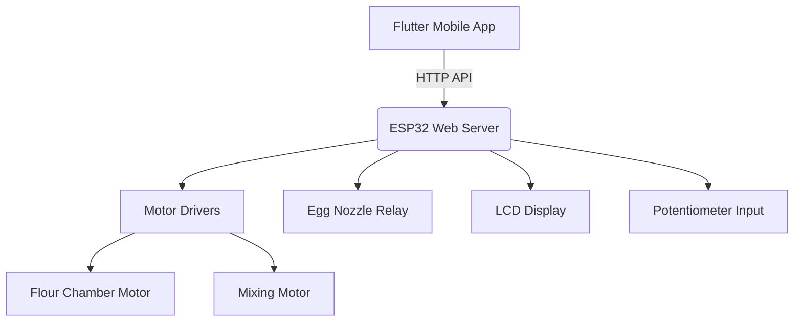

# **Smart Coating System with Flutter App**  

**An IoT-enabled automated coating system controlled via ESP32 and Flutter mobile app.**  

## **📌 Table of Contents**  
- [Project Overview](#-project-overview)  
- [Key Features](#-key-features)  
- [System Architecture](#-system-architecture)  
- [Hardware Components](#-hardware-components)  
- [Software & Libraries](#-software--libraries)  
- [Setup & Installation](#-setup--installation)  
- [Flutter App Integration](#-flutter-app-integration)  
- [API Endpoints](#-api-endpoints)  
- [Safety & Diagnostics](#-safety--diagnostics)  
- [Future Improvements](#-future-improvements)  
- [Contributing](#-contributing)  
- [License](#-license)  

---

## **🌐 Project Overview**  
This project is an **automated coating system** designed for industrial or food processing applications (e.g., batter coating, pharmaceutical coating). It consists of:  
- **ESP32 microcontroller** (Wi-Fi/BLE) for motor control, sensor interfacing, and web server hosting.  
- **Flutter mobile app** for remote monitoring and control.  
- **Customizable process sequences** (egg dispensing, flour coating, mixing intervals).  
- **Real-time feedback** via LCD and mobile app.  

---

## **✨ Key Features**  
✅ **Automated Coating Process**  
- Adjustable durations for egg nozzle, flour chamber, and mixing motor.  
- Interval-based control for precise ingredient dispensing.  

✅ **Dual Connectivity Modes**  
- **Wi-Fi Station Mode** (connects to existing network).  
- **Access Point (AP) Mode** (creates its own hotspot).  

✅ **Mobile & Web Control**  
- **Flutter app** for Android/iOS.  
- **Web interface** for direct configuration.  

✅ **Safety & Diagnostics**  
- Emergency stop function.  
- Watchdog timer for system recovery.  
- Motor current monitoring (future implementation).  

✅ **EEPROM Storage**  
- Save and load process settings (nozzle timing, motor speeds, intervals).  

---

## **📡 System Architecture**  


---

## **🛠️ Hardware Components**  
| Component | Description |  
|-----------|-------------|  
| **ESP32 Dev Board** | Main microcontroller (Wi-Fi/BLE). |  
| **L298N Motor Driver** | Controls flour chamber and mixing motors. |  
| **Relay Module** | Triggers egg nozzle solenoid. |  
| **I2C LCD (16x2)** | Displays system status and menus. |  
| **Potentiometer** | Adjusts motor speeds & timing settings. |  
| **Push Buttons** | Navigation and menu control. |  
| **Buzzer** | Alarm for errors/completion. |  

---

## **💻 Software & Libraries**  
- **Arduino IDE** (ESP32 Core)  
- **Libraries Used:**  
  - `WiFi.h` (Wi-Fi connectivity)  
  - `AsyncTCP` & `ESPAsyncWebServer` (HTTP API)  
  - `ArduinoJson` (JSON parsing)  
  - `LiquidCrystal_I2C` (LCD control)  
  - `Preferences` (EEPROM storage)  
- **Flutter (Dart)** for cross-platform mobile app.  

---

## **⚙️ Setup & Installation**  

### **1. Flashing the ESP32**  
1. Install **ESP32 Arduino Core** via Arduino IDE.  
2. Upload the provided firmware (`coating_system.ino`).  
3. Configure Wi-Fi credentials or use **AP mode** (default SSID: `CoatingSystem`).  

### **2. Wiring Guide**  
| ESP32 Pin | Component |  
|----------|-----------|  
| GPIO 23  | ENA (Flour Motor PWM) |  
| GPIO 19  | ENB (Mixing Motor PWM) |  
| GPIO 16  | IN1 (Motor A Direction) |  
| GPIO 4   | IN2 (Motor A Direction) |  
| GPIO 17  | IN3 (Motor B Direction) |  
| GPIO 18  | IN4 (Motor B Direction) |  
| GPIO 13  | Egg Nozzle Relay |  
| GPIO 33  | Potentiometer (Analog Input) |  

### **3. Flutter App Setup**  
```bash  
git clone [flutter-app-repo]  
cd coating_app  
flutter pub get  
flutter run  
```  

---

## **📱 Flutter App Integration**  
The app communicates with the ESP32 via **HTTP API** and provides:  
- **Real-time motor status** (speed, active/inactive).  
- **Process timer visualization**.  
- **Manual override controls**.  
- **Sequence presets** (save/load configurations).  

---

## **🔌 API Endpoints**  
| Endpoint | Method | Description |  
|----------|--------|-------------|  
| `/api/status` | GET | System status (motor speeds, timers). |  
| `/api/start` | POST | Starts the coating process. |  
| `/api/stop` | POST | Emergency stop. |  
| `/api/sequence` | GET/POST | Load/save process settings. |  
| `/api/manual/egg` | POST | Manually trigger egg nozzle. |  
| `/api/manual/flour` | POST | Adjust flour motor speed. |  

---

## **⚠️ Safety & Diagnostics**  
- **Emergency Stop** – Halts all motors instantly.  
- **Watchdog Timer** – Auto-reset if system freezes.  
- **Error Logging** – Last 3 errors stored in EEPROM.  
- **Diagnostic Mode** – Tests motors, nozzle, and buzzer on boot.  

---

## **🚀 Future Improvements**  
- [ ] **Current Sensing** – Detect motor overload.  
- [ ] **MQTT/Cloud Integration** – Remote monitoring.  
- [ ] **OTA Updates** – Wireless firmware upgrades.  
- [ ] **Multi-language Support** (Flutter app).  

---

## **🤝 Contributing**  
PRs and issues welcome!  
1. Fork the repo.  
2. Create a feature branch (`git checkout -b new-feature`).  
3. Commit changes (`git commit -am 'Add feature'`).  
4. Push to branch (`git push origin new-feature`).  
5. Open a **Pull Request**.  

---

## **📜 License**  
**MIT License** – Free for personal and commercial use.  

---

**🌟 Show Your Support**  
If you find this project useful, give it a ⭐ on GitHub!  

🔗 **GitHub Link**:  https://github.com/derekzyl/peanut_arduino
📧 **Contact**: cybersgenii@gmail.com
#IoT #ESP32 #Flutter #Automation #EmbeddedSystems